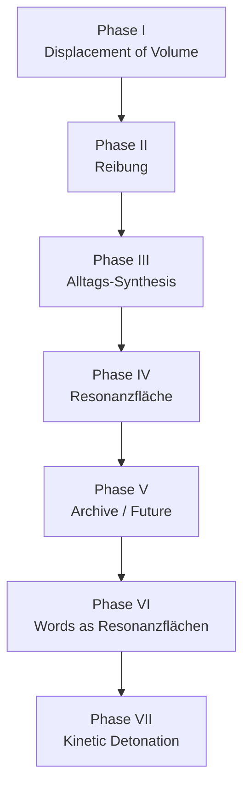
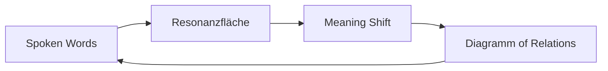

# Requisition

FORMKUNST is a seven-phase manifesto site built as a one-page Node.js application.

## Content Map

## Resonance Diagram

## Notes

- `server.js` serves the static page on port 3000.
- The page uses scroll activation, typewriter text, and particle/parallax effects.
- Phase IV now centers on Resonanzfläche and Phase VI extends that idea into a diagram of words and relations.